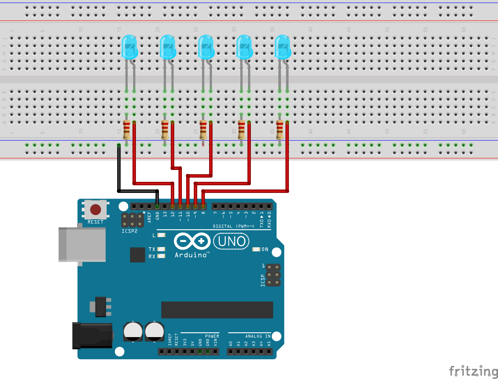
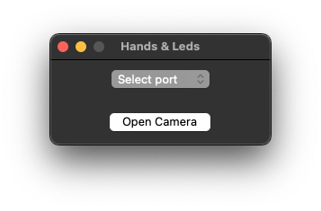
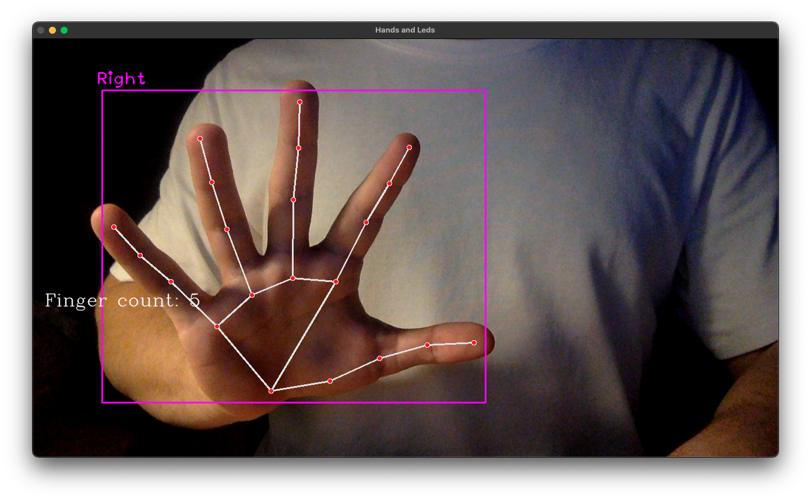

# hands-leds

Simple hands detector maked using [cvzone](https://github.com/cvzone/cvzone) for this scope (see [OpenCV](https://github.com/opencv/opencv) and [mediapipe](https://github.com/google/mediapipe) for more information) and [firmata](https://github.com/firmata/arduino) protocol for communication with microcontroller Arduino.

The result of this detection results in the hardware turning on/off of 5 led diodes.

# Usage
From Arduino IDE go to ```File > Examples > Firmata > StandardFirmata.ino```. Once you open the code you need to connect the Arduino microcontroller and load the ```StandardFirmata.ino``` sketch.

Now open your ```Terminal``` and clone this repository with the following command:

```
git clone https://github.com/AntonioBerna/hands-leds.git
```

Now use ```cd hands-leds/``` to access the directory, make virtual environment and start it with the following commands:

```
virtualenv venv
source venv/bin/activate
```

Good! Now install the requirements for using project with the following commands:

```
pip install cvzone
pip install pyfirmata
pip install mediapipe
```

or

```
pip install -r requirements.txt
```

Perfect! Now that everything is ready you need to build the electrical circuit with the 5 led diodes. Here is what the schematic looks like:

<p align="center">
    
</p>

Finally, we can send the project into execution with the following command:

```
python src/main.py
```

>**NOTE:** Remember to check if your Arduino is connected to a USB port!

Don't worry if you forgot to connect your Arduino, my program will notify you with the following message:

```
No Arduino port found.
```

If all goes well after running ```python src/main.py``` you should see the following window:

<p align="center">
    
</p>

Now all you need to do is select the port on which Arduino is connected (from the drop-down menu provided) and click on the **Open Camera** button to display the following outputs:

<p align="center">
    
</p>

<p align="center">
    
</p>

>**NOTE:** This project is fully compatible with macOS and I am working on compatibility with Linux :hammer:
